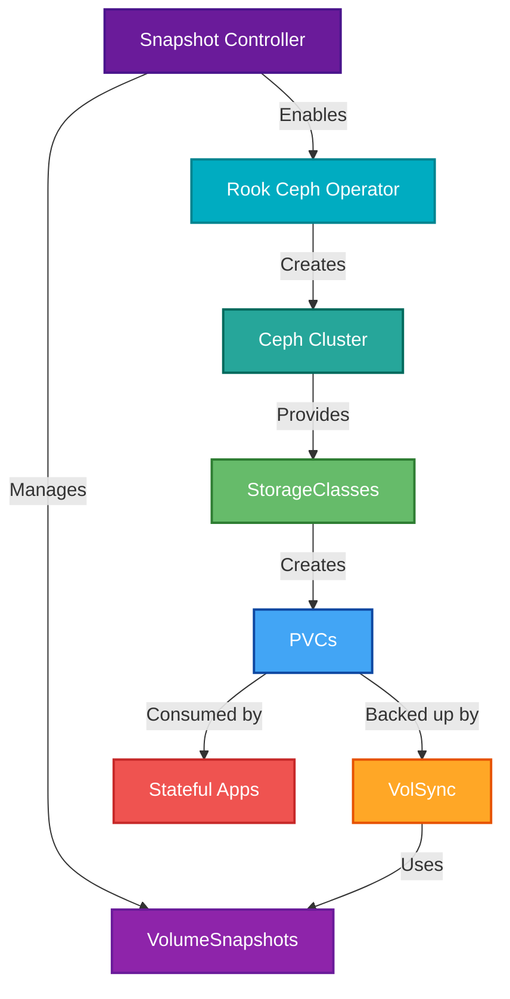

<div align="center">

### My homelab k8s cluster 

_... automated via [Flux](https://github.com/fluxcd/flux2), [Renovate](https://github.com/renovatebot/renovate), and [GitHub Actions](https://github.com/features/actions)_ 

</div>

<div align="center">

[](https://discord.gg/home-operations)&nbsp;&nbsp;
[](https://talos.dev)&nbsp;&nbsp;
[](https://kubernetes.io)&nbsp;&nbsp;
[](https://fluxcd.io)&nbsp;&nbsp;
[](https://github.com/cpritchett/home-ops/actions/workflows/renovate.yaml)

</div>

<div align="center">

[](https://status.hypyr.space)&nbsp;&nbsp;
[](https://status.hypyr.space)

</div>

<div align="center">

[](https://github.com/kashalls/kromgo)&nbsp;&nbsp;
[](https://github.com/kashalls/kromgo)&nbsp;&nbsp;
[](https://github.com/kashalls/kromgo)&nbsp;&nbsp;
[](https://github.com/kashalls/kromgo)&nbsp;&nbsp;
[](https://github.com/kashalls/kromgo)&nbsp;&nbsp;
[](https://github.com/kashalls/kromgo)&nbsp;&nbsp;
[](https://github.com/kashalls/kromgo)&nbsp;&nbsp;
[](https://github.com/kashalls/kromgo)

</div>

---

##  Overview

This is a repository for my home infrastructure and Kubernetes cluster. I try to adhere to Infrastructure as Code (IaC) and GitOps practices using tools like [Kubernetes](https://github.com/kubernetes/kubernetes), [Flux](https://github.com/fluxcd/flux2), [Renovate](https://github.com/renovatebot/renovate), and [GitHub Actions](https://github.com/features/actions).

---

##  Kubernetes

This semi hyper-converged cluster operates on [Talos Linux](https://github.com/siderolabs/talos), an immutable and ephemeral Linux distribution tailored for [Kubernetes](https://github.com/kubernetes/kubernetes), and is deployed on bare-metal [MS-A2](https://store.minisforum.com/products/minisforum-ms-a2) workstations. [Rook](https://github.com/rook/rook) supplies my workloads with persistent block, object, and file storage, while a separate server handles media file storage. The cluster is designed to enable a full teardown without any data loss.

There is a template at [onedr0p/cluster-template](https://github.com/onedr0p/cluster-template) if you want to follow along with some of the practices I use here.

### Core Components

- [actions-runner-controller](https://github.com/actions/actions-runner-controller): Self-hosted Github runners.
- [cert-manager](https://github.com/cert-manager/cert-manager): Creates SSL certificates for services in my cluster.
- [cilium](https://github.com/cilium/cilium): eBPF-based networking for my workloads.
- [cloudflared](https://github.com/cloudflare/cloudflared): Enables Cloudflare secure access to my routes.
- [external-dns](https://github.com/kubernetes-sigs/external-dns): Automatically syncs ingress DNS records to a DNS provider.
- [external-secrets](https://github.com/external-secrets/external-secrets): Managed Kubernetes secrets using [1Password Connect](https://github.com/1Password/connect).
- [multus](https://github.com/k8snetworkplumbingwg/multus-cni): Multi-homed pod networking.
- [rook](https://github.com/rook/rook): Distributed block storage for persistent storage.
- [spegel](https://github.com/spegel-org/spegel): Stateless cluster local OCI registry mirror.
- [volsync](https://github.com/backube/volsync): Backup and recovery of persistent volume claims.

### GitOps

[Flux](https://github.com/fluxcd/flux2) watches my [kubernetes](./kubernetes) folder (see Directories below) and makes the changes to my clusters based on the state of my Git repository.

The way Flux works for me here is it will recursively search the [kubernetes/apps](./kubernetes/apps) folder until it finds the most top level `kustomization.yaml` per directory and then apply all the resources listed in it. That aforementioned `kustomization.yaml` will generally only have a namespace resource and one or many Flux kustomizations (`ks.yaml`). Under the control of those Flux kustomizations there will be a `HelmRelease` or other resources related to the application which will be applied.

[Renovate](https://github.com/renovatebot/renovate) monitors my **entire** repository for dependency updates, automatically creating a PR when updates are found. When some PRs are merged Flux applies the changes to my cluster.

### Directories

This Git repository contains the following directories under [kubernetes](./kubernetes).

```sh
📁 kubernetes      # Kubernetes cluster defined as code
├─📁 apps          # Apps deployed into my cluster grouped by namespace (see below)
├─📁 components    # Re-usable kustomize components
└─📁 flux          # Flux system configuration
```

### Cluster layout

This shows the two fundamental infrastructure workflows that enable secure, stateful applications in GitOps. These dependency chains solve the hardest problems newcomers face when building production-ready clusters: **secrets management** and **persistent storage**.

#### GitOps Security Pipeline 🔒

_Solves the "chicken and egg" problem of bootstrapping secrets in GitOps_


#### Storage + Backup Foundation 💾

_Provides persistent storage with automated backup/restore capabilities_



**Why These Workflows Matter:**

🔐 **Security Pipeline**: Traditional "secrets in git" approaches don't work for production. This 1Password Connect workflow solves the bootstrap problem by providing a secure, auditable way to inject secrets into your cluster without storing them in Git. Each ExternalSecret automatically syncs from 1Password, enabling secure GitOps practices.

**Why External Secret Stores?** While SOPS (Secrets OPerationS) is popular for encrypting secrets in GitOps homelabs, I just don't like it. I don't like dealing with the vscode plugins, and I don't like managing yet another tool. What I do like is using the secret manager where my passwords already live.

**Secret Store Options**: This cluster uses **1Password Connect** (self-hosted), but there are many alternatives. Popular choices include HashiCorp Vault (powerful but complex), Bitwarden (familiar and self-hostable), Infisical (modern developer experience), and Doppler (simple cloud integration). 1Password also offers Service Accounts for easier cloud-based setup.

Check the [Home Operations Discord](https://discord.gg/home-operations) for community experiences with different providers. Your choice depends on your security requirements, operational preferences, and existing infrastructure.

💾 **Storage Foundation**: Stateful applications need reliable storage with backup/restore capabilities. This workflow shows how Rook Ceph provides distributed storage while VolSync handles automated backups using VolumeSnapshots. The Snapshot Controller enables point-in-time recovery for all your critical data.

### Networking

<details>
  <summary>Click to see a high-level network diagram</summary>

</details>

---

##  DNS

In my cluster there are two instances of [ExternalDNS](https://github.com/kubernetes-sigs/external-dns) running. One for syncing private DNS records to my `UDM Pro Max` using [ExternalDNS webhook provider for UniFi](https://github.com/kashalls/external-dns-unifi-webhook), while another instance syncs public DNS to `Cloudflare`. This setup is managed by creating routes with two specific gatways: `internal` for private DNS and `external` for public DNS. The `external-dns` instances then syncs the DNS records to their respective platforms accordingly.

---

##  Hardware

<details>
  <summary>Click to see my rack</summary>

  
</details>

| Device                     | Count | OS Disk Size  | Data Disk Size    | Ram   | Operating System | Purpose                 |
| -------------------------- | ----- | ------------- | ----------------- | ----- | ---------------- | ----------------------- |
| Beelink EQ12               | 2     | 512GB (SSD)   | 512GB (NVME)      | 32GB  | Talos            | Kubernetes              |
| Intel NUC7                 | 1     | 512GB (SSD)   | 512GB (NVME)      | 32GB  | Talos            | Kubernetes              |
| 45Drives HL15              | 1     | 2x512GB (SSD) | 8x14TB HDD        | 128GB | TrueNAS Scale    | NFS                     |
| PiKVM (RasPi 4)            | 1     | -             | -                 | 4GB   | PiKVM            | KVM                     |
| TESmart 8 Port KVM Switch  | 1     | -             | -                 | -     | -                | Network KVM (for PiKVM) |
| UniFi Gateway Max          | 1     | -             | 512 (NVME)        | -     | UniFi OS         | Router & NVR            |
| UniFi USW Enterprise 8 POE | 1     | -             | -                 | -     | UniFi OS         | 2.5Gb Core Switch       |
| UniFi USW Pro 8            | 1     | -             | -                 | -     | UniFi OS         | Garage PoE Switch       |
| Lenovo Thinkstation P520   | 1     | -             | Many Mixed NVME's | 128GB | UnRAID           | Secondary/Flash NAS     |

---

##  Troubleshooting

### Common Issues

- **Renovate Permission Issues**: If you see "Cannot access vulnerability alerts" or "Package lookup failures", see [`docs/RENOVATE-TROUBLESHOOTING.md`](./docs/RENOVATE-TROUBLESHOOTING.md)
- **Renovate Configuration**: For details on how Renovate is configured and best practices, see [`docs/RENOVATE-CONFIG-GUIDE.md`](./docs/RENOVATE-CONFIG-GUIDE.md)
- **Cluster Issues**: For node, storage, or networking problems, see [`docs/CLUSTER-TROUBLESHOOTING.md`](./docs/CLUSTER-TROUBLESHOOTING.md)
- **Setup Issues**: For initial setup problems, see [`docs/SETUP-GUIDE.md`](./docs/SETUP-GUIDE.md)

### Quick Fixes

```bash
# Fix secret sync issues
task k8s:sync-secrets

# Fix Renovate permissions
./scripts/fix-renovate-permissions.sh

# Browse storage issues
task k8s:browse-pvc CLAIM=<pvc-name>
```

##  Stargazers

<div align="center">

<a href="https://star-history.com/#cpritchett/home-ops&Date">
  <picture>
    <source media="(prefers-color-scheme: dark)" srcset="https://api.star-history.com/svg?repos=cpritchett/home-ops&type=Date&theme=dark" />
    <source media="(prefers-color-scheme: light)" srcset="https://api.star-history.com/svg?repos=cpritchett/home-ops&type=Date" />
    
  </picture>
</a>

</div>

---

##  Gratitude and Thanks

Many thanks to [@onedrop](https://github.com/onedr0p), [@buroa](https://github.com/buroa) and all the fantastic people who donate their time to the [Home Operations](https://discord.gg/home-operations) Discord community. Be sure to check out [kubesearch.dev](https://kubesearch.dev) for ideas on how to deploy applications or get ideas on what you may deploy.

---

##  Changelog

See the latest [release](https://github.com/cpritchett/home-ops/releases/latest) notes.

---

##  License

See [LICENSE](./LICENSE).
